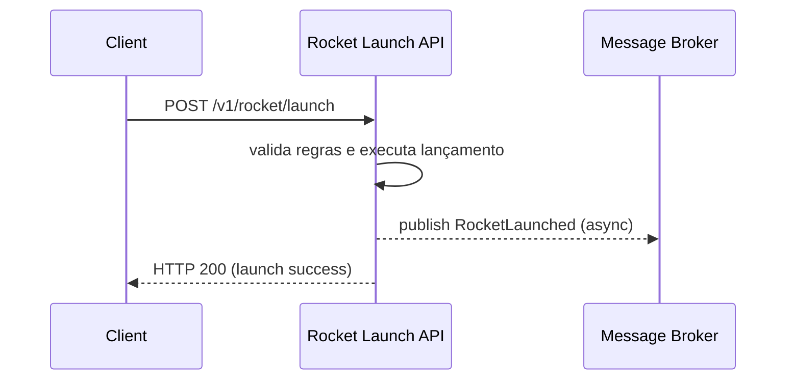
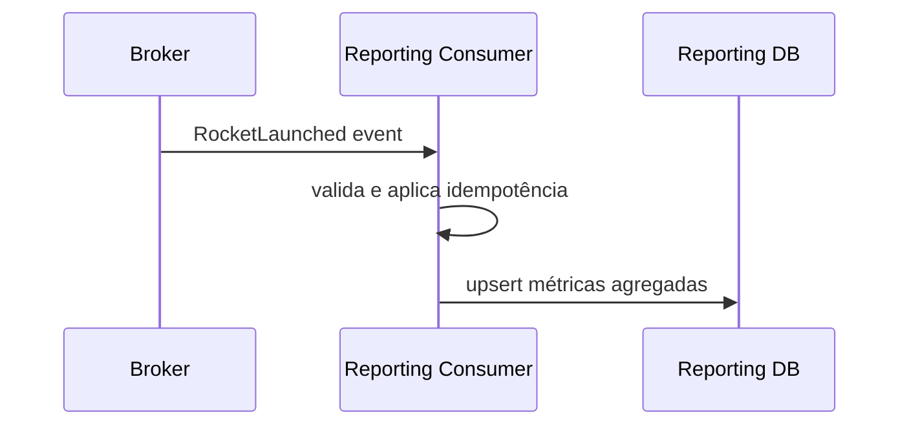

# Questão 2 — Relatório de Utilização do Serviço de Lançamentos

## Contexto

Foi solicitada a criação de um relatório que apresente a utilização do serviço de lançamentos de foguetes, segmentado por cliente, considerando um intervalo de 30 dias.

O principal requisito da solução é **não impactar o fluxo de execução do endpoint de lançamentos**, que representa o core do produto. Além disso, falhas no novo workflow de relatórios **não podem afetar o serviço principal**.


## Objetivos da Solução

- Garantir **isolamento total** entre o serviço de lançamentos e o relatório
- Evitar qualquer degradação de performance no endpoint `/v1/rocket/launch`
- Persistir dados em uma **base paralela**
- Permitir escalabilidade e reprocessamento
- Manter observabilidade e confiabilidade do sistema

## Arquitetura Proposta

A solução é baseada em **arquitetura orientada a eventos**, utilizando comunicação **assíncrona** para desacoplar completamente o fluxo crítico (lançamento de foguetes) do fluxo analítico (relatórios).

O serviço de lançamentos passa a ter a responsabilidade apenas de **emitir eventos de domínio** após a conclusão bem-sucedida de um lançamento, sem depender do processamento desses eventos. O consumo, processamento e persistência dos dados necessários para o relatório são realizados por um serviço independente.

Após a execução bem-sucedida do método service.launch(...), o próprio LaunchService seria responsável por publicar o evento RocketLaunched, mantendo o controller desacoplado da lógica de mensageria e respeitando princípios de responsabilidade única.

Essa abordagem reduz acoplamento, melhora a resiliência do sistema e permite que o relatório evolua de forma independente do core.

## Diagrama de Sequência

### Fluxo de Lançamento (Síncrono)
Este diagrama representa o fluxo crítico do sistema. Note que o retorno da requisição ocorre antes de qualquer processamento relacionado ao relatório, garantindo que o cliente não seja impactado por falhas externas.



A publicação do evento ocorre no modelo fire-and-forget, com timeout curto e tratamento de exceções, garantindo que falhas no broker não interrompam o fluxo principal.

### Fluxo de Relatório (Assíncrono)
O fluxo abaixo ocorre fora do ciclo de vida da requisição original e pode sofrer retries, atrasos ou reprocessamentos sem qualquer impacto no serviço principal.



## Modelo de Dados

Para atender ao relatório de 30 dias de forma eficiente, os dados são armazenados de maneira pré-agregada por cliente e por dia. Essa estratégia reduz o volume de dados consultados e evita operações custosas em tempo de leitura.

### Tabela: `launch_metrics`

| Campo         | Type      | Descrição                          |
|---------------|-----------|------------------------------------|
| customer_id   | UUID      | Identificador do cliente           |
| day           | DATE      | Dia do lançamento                  |
| launch_count  | INTEGER   | Quantidade de lançamentos no dia   |
| updated_at    | TIMESTAMP | Data da última atualização         |

**Chave primária composta:** `(customer_id, day)`


## Endpoint de Relatório

```
GET /v1/reports/rocket-launches?days=30
```

O endpoint de relatório consulta exclusivamente a base paralela, realizando apenas operações de leitura e agregação.
Dessa forma, não há qualquer dependência ou concorrência com o banco transacional do serviço de lançamentos.


## Resiliência e Isolamento

A solução garante resiliência através das seguintes estratégias:

- O serviço de lançamentos não depende do sucesso da publicação do evento

- Falhas no broker, consumer ou base de relatórios não impactam o endpoint principal

- O consumer utiliza políticas de retry com backoff exponencial

- Eventos inválidos ou não processáveis são enviados para uma Dead Letter Queue (DLQ)

- Infraestrutura e banco de dados do relatório são isolados do core do sistema

Esse isolamento assegura que o core continue estável mesmo em cenários de falha parcial.

## Observabilidade

A solução proposta considera observabilidade como um pilar fundamental para garantir confiabilidade, rápida detecção de falhas e facilidade de operação em produção. Como o workflow de relatórios é assíncrono e desacoplado, torna-se essencial possuir visibilidade completa sobre o comportamento do sistema, mesmo fora do ciclo de vida da requisição original.

### Logs

São utilizados **logs estruturados** em todos os componentes envolvidos (serviço de lançamentos, publisher de eventos e consumer), permitindo correlação e análise eficiente.

Os principais campos registrados incluem:
- `trace_id`, utilizado para correlacionar eventos ao longo de todo o fluxo
- `customer_id` e `launch_id`, para facilitar análise por cliente ou operação
- status da publicação do evento (sucesso ou falha)
- informações de erro, tentativas de retry e envio para DLQ no consumer

Essa abordagem facilita a investigação de falhas, auditoria de eventos e análise de comportamento anômalo do sistema.

### Métricas

Além dos logs, são expostas métricas que permitem acompanhamento contínuo da saúde e performance do sistema.

Algumas métricas relevantes incluem:
- `rocket_launch_total`, para monitorar o volume de lançamentos realizados
- `report_event_publish_total{status=success|fail}`, para identificar falhas na publicação de eventos
- `report_consumer_events_processed_total`, indicando throughput do consumer
- `report_consumer_events_failed_total`, para detecção de erros recorrentes
- `report_consumer_lag`, que indica atraso entre produção e consumo dos eventos

Essas métricas permitem identificar gargalos, degradações de performance, atrasos no processamento do relatório e possíveis problemas de infraestrutura antes que afetem o negócio.

### Tracing

O sistema utiliza **tracing distribuído**, propagando o `trace_id` desde a requisição inicial no serviço de lançamentos até o processamento final no consumer de relatórios.

Mesmo sendo um fluxo assíncrono, o uso do `trace_id` permite reconstruir o caminho completo de uma operação, facilitando:
- análise de latência entre componentes
- identificação de pontos de falha
- correlação entre logs, métricas e eventos

Essa visibilidade ponta a ponta é essencial para operação e evolução segura da solução em ambientes distribuídos.

## Estratégia de Testes

### Testes Unitários

- Falha ao publicar evento não afeta resposta do lançamento
- Validação da lógica de agregação diária
- Garantia de idempotência no consumer

### Testes de Integração

- Producer → Broker → Consumer → Base de Relatórios
- Validação da persistência correta dos dados

### Testes de Resiliência

- Broker indisponível: lançamento continua funcionando
- Base de relatórios indisponível: consumer faz retry ou DLQ
- Restart do consumer sem duplicação de dados

### Testes de Performance

- Testes de carga no endpoint de launch com e sem broker disponível
- Validação de que p95/p99 do endpoint não sofre degradação
- Testes de throughput do consumer


A solução proposta garante que o relatório de utilização seja gerado de forma escalável, resiliente e desacoplada do serviço principal. A utilização de eventos, base paralela e observabilidade completa assegura que o core do produto permaneça estável, mesmo em cenários de falha no workflow de relatórios.
O relatório é eventualmente consistente, o que é aceitável para casos analíticos, garantindo proteção total ao fluxo transacional do sistema.